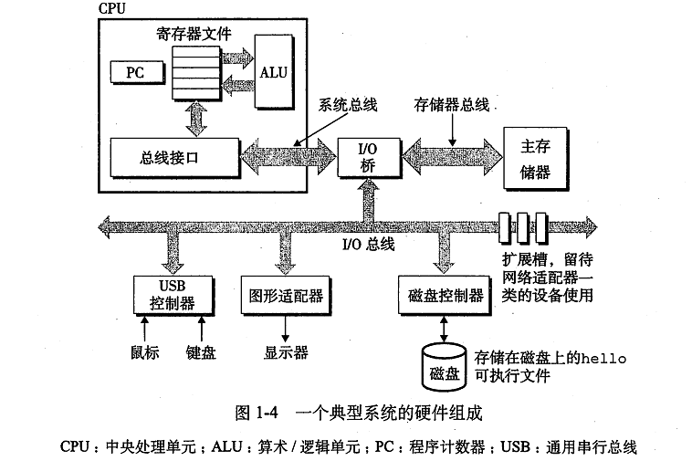

# 计算机系统漫游
计算机系统由硬件和系统软件组成，它们共同工作来运行应用程序。

## 信息就是位+上下文
系统中的所有信息-包括磁盘文件、存储器的程序和用户数据以及网络上的传输数据，都是由一串位表示。
区分不同数据对象的唯一方法是读取这些对象时的上下文。比如在不同上下文下，一个同样的字节序列可能是一个整数、浮点数、字符串或机器指令。

## 程序被其他程序翻译成不同的格式
C语言程序翻译成一个可执行目标文件，执行四个阶段的程序（预处理器、编译器、汇编器和链接器）。

- 预处理阶段。根据#开头的命令，修改原始C程序，得到另一个C程序，通常以.i作为拓展名的文本文件。
- 编译阶段。编译器将.i文件翻译成.s文件，它是包含一个汇编语言程序的文本文件。
- 汇编阶段。汇编将.s文件翻译成机器语言指令，并打包成一种可重定位目标程序（relocatable object program）的格式。结果保存在.o文件中。
- 链接阶段。链接器将目标文件合并，生成一个可执行目标文件。

## 处理器读取并解释存储在存储器中的指令
### 系统硬件组成

典型的硬件组织  

#### 1.总线
贯穿整个系统的一组电子管道，负责各个部件间信息字节的传递。通常传递定长字节块，称为字（word）。

#### 2.I/O设备
是与外部世界联系的通道。
I/O设备通过**控制器**或**适配器**与I/O总线相连。
控制器是置于主板上的芯片组，适配器是插在主板插槽上的卡。

#### 3.主存
一个临时存储设备，执行程序时，存放程序和数据。物理上由一组动态随机存取存储器（DRAM）芯片组成。逻辑上可看做一个线性字节数组。

#### 4.处理器
CPU，解释执行存储在主存中指令的引擎。
**指令集结构描述**的是每条机器指令的效果，**微体系结构**描述的是处理器实际如何实现指令功能的。

## 高速缓存  

高速缓存是用一种叫做静态随机访问存储器（SRAM）的硬件技术实现。

## 存储设备的层次结构

## 操作系统管理硬件
操作系统是应用程序和硬件之间插入的一层软件。  
  

操作系统有两个基本功能：
1. 防止硬件被失控的应用程序滥用。
2. 向应用程序提供简单一致的机制来控制复杂的低级硬件设备。

操作系统通过几个基本的抽象概念来实现这两个功能。文件是I/O设备的抽象表示，虚拟存储器是对主存和磁盘I/O设备的抽象，进程是对处理器、主存和I/O设备的抽象。   

### 进程
进程是操作系统对一个正在运行的程序的一种抽象。
操作系统处理多个进程直接交错执行，这种机制称为上下文切换。   

一个进程由多个称为**线程**的执行单元组成，每个线程都运行在进程的上下文，共享同样的代码和全局数据。

### 虚拟存储器
虚拟存储器为进程提供一种假象，即每个进程都在独占地使用主存。每个进程看到的是一致的存储器，称为**虚拟地址空间**。  

虚拟地址空间从最低地址开始，依次是：
- 程序代码和数据。
- 堆。堆可在运行时动态的扩展和收缩。
- 共享库。
- 栈。编译器用它实现函数调用。用户栈在程序执行期间可以动态的扩展和收缩。
- 内核虚拟存储器。内核总是驻留在内存中，是操作系统的一部分。

### 文件
文件是字节序列。每个I/O设备，包括磁盘、键盘、显示器甚至网络，都可以视为文件。

## 并发和并行
1. 线程级并发。
2. 指令级并行。同时执行多条指令的属性称为指令级并行。
3. 单指令多数据并行。一条指令产生多个可以并行执行的操作，即SIMD并行。

## 抽象的重要性

