# 信息的表示和处理
现代计算机存储和处理的信息以二值信号表示。

## 信息存储　　
大多数计算机使用8位组成的字节(byte)作为最小的可寻址的存储器单位。机器级程序将存储器视为一个非常大的字节数组，称为虚拟存储器(virtual memory)。存储器每个字节有唯一的数字来标识，称为地址(address)，所有可能地址的集合称为虚拟地址空间(virtual address space)。

### 字
每台计算机都有一个字长(word size)，指明整数和指针数据的标称大小。字长w位的机器，虚拟地址范围0~2<sup>w-1</sup>

### 数据大小
C语言支持整数和浮点数的多种数据格式。  
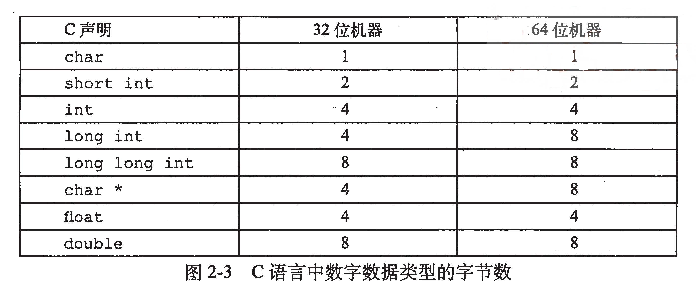  
C语言对不同数据类型的数字范围设置了下界，却没有设置上界。

### 寻址和字节顺序
w位的整数[x<sub>w-1</sub>, x<sub>w-2</sub>, ..., x<sub>1</sub>, x<sub>0</sub>]其中x<sub>w-1</sub>是最高有效位，若w是8的倍数，最高有效字节是[x<sub>w-1</sub>, x<sub>w-2</sub>, ..., x<sub>w-7</sub>, x<sub>w-8</sub>]，最低有效字节[x<sub>7</sub>, x<sub>6</sub>, ..., x<sub>1</sub>, x<sub>0</sub>]。  
按照最低有效字节到最高有效字节顺序存储，称为**小端法**。按照最高有效字节到最低有效字节顺序存储，称为**大端法**。  
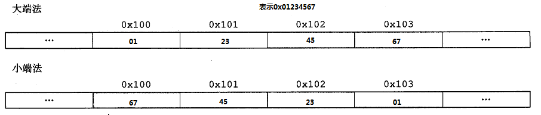
大多数Intel兼容机采用小端法，大多数IBM和SUN机器采用大端法，很多新处理器采用双端法，可配置成大端或小端。

### 表示字符串
C语言中字符串是以null(值为0)字符结尾的字符数组。  
计算机系统的一个基本概念就是从机器的角度来看，程序仅仅只是字节序列。  

### 布尔代数
### C语言中的位级运算
### C语言中的移位运算
对于位表示[x<sub>n-1</sub>, x<sub>n-2</sub>, ... ,x<sub>0</sub>],x向左移动k位，丢弃最高的k位，并在右端补k个0，新值是[x<sub>n-k-1</sub>, x<sub>n-k-2</sub>, ... ,x<sub>0</sub>, 0, ..., 0]。  
一般而言，机器支持两种右移：逻辑右移和算术右移。对于右移运算x>>k，逻辑右移在左端补k个0，得到[0, ..., 0, x<sub>n-1</sub>, x<sub>n-2</sub>, ... ,x<sub>k</sub>]；算术右移在左端补k个最高有效位的值，得到结果[x<sub>n-1</sub>, ..., x<sub>n-1</sub>,x<sub>n-1</sub>, x<sub>n-2</sub>, ... ,x<sub>k</sub>]。  
C语言没有明确定义应该使用哪种类型的右移。对于无符号数据，右移必须是逻辑的，对于有符号数据，算术或逻辑右移都可以。实际上，几乎所有编译器对有符号数据进行算术右移。

## 整数表示
用位来编码整数的两种不同的方式：一种只能表示非负数，另一种能够表示负数、零和正数。

### 整型数据类型
C语言支持多种整型类型，C语言定义每种类型最小的取值范围。   
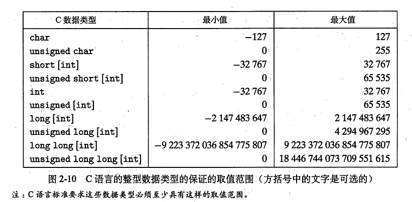   

### 无符号的编码 
一个整数有w位，写作：  
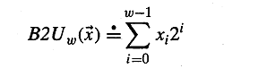   
函数B2U<sup>w</sup>将一个长度为w的0、1串映射到非负整数。
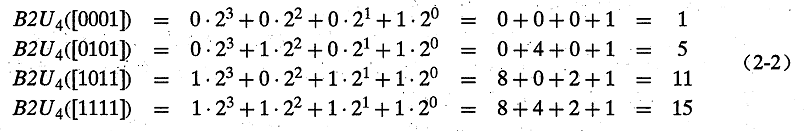  

### 补码编码
最常见的有符号数的计算机表示方式就是补码(two's complement)形式。  
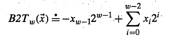   
最高有效位是符号位，权重是-2<sup>w-1</sup>  
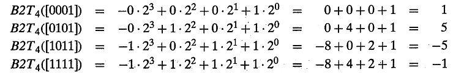 

#### 有符号数的其他表示方法
有符号数还有两种标准的表示方法：  
**反码(Ones' Complement)**：除了最高有效位的权是-(2<sup>w-1</sup> - 1),它和补码是一样的：  
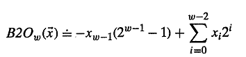 

**原码(Sign-Magnitude)**：最高有效位是符号位，用来确定剩下的位应该取负权还是正权：
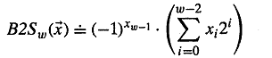 

### 有符号数和无符号数之间的转换  
大多数C语言的实现是从位级角度来看类型转换的。  
```C
short int v = -12345;
unsigned short uv = (unsigned short)v;
printf("v = %d, uv = %u\n", v, uv);
```
在采用补码的机器上，上述代码的输出是:  
v= -12345, uv = 53191   
强制类型转换的结果保持位值不变，只是改变解释这些位的方式。
大多数C语言实现，处理同样字长的有符号数和无符号数之间的转换的一般规则是：数值可能会改变，但位模式不变。

### 扩展一个数字的位表示
将一个无符号数转换为一个更大的数据类型，只需简单的在表示开头添加0，称为**零扩展(zero extension)**。将一个补码数字转换为一个更大的数据类型可以进行**符号扩展(sign extension)**，规则是在表示中添加最高有效位。

### 截断数字
将一个w位的数[x<sub>w-1</sub>, x<sub>w-2</sub>, ..., x<sub>0</sub>]截断为一个k为数字，会丢弃高w-k位，得到[x<sub>k-1</sub>, x<sub>k-2</sub>, ..., x<sub>0</sub>] 

## 整数运算

### 无符号加法
两个无符号数x,y的加法运算：  
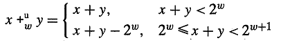   

### 补码加法  
两个数x,y的补码加法运算：  
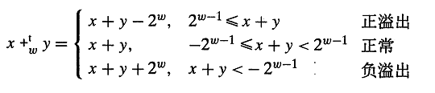   

### 无符号乘法  
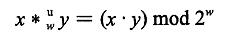 

### 补码乘法
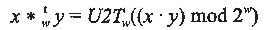  


## 浮点数
浮点表示对形如V=x x 2<sup>y</sup>的有理数进行编码。  
IEEE 754标准制订表示浮点数及其运算的标准。  

### 二进制小数
二进制表示法b<sub>m</sub>b<sub>m-1</sub>...b<sub>1</sub>b<sub>0</sub>.b<sub>-1</sub>b<sub>-2</sub>...b<sub>-n</sub>。b<sub>i</sub>的取值范围是0和1。这种表示法表示的数b定义是：  
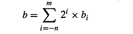    

### IEEE浮点表示
IEEE浮点标准使用V=(-1)<sup>s</sup> x M x 2<sup>E</sup>表示一个数:
- **符号(sign)** s决定是负数还是正数。
- **尾数(significand)** M是一个二进制小数。
- **阶码(exponent)** E的作用是对浮点数加权。权重是2的E次幂。 

一个单独的符号位s直接编码符号s，k位的阶码字段exp=e<sup>k-1</sup>...e<sup>1</sup>e<sup>0</sup>编码阶码E。n位小数frac编码尾数M。  
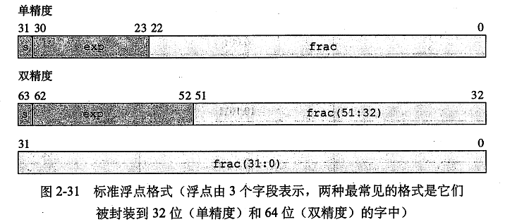    
根据exp的值，被编码的值可以分成3种不同的情况。  
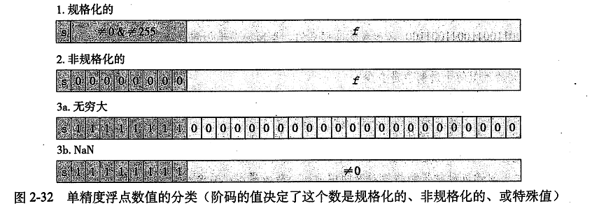  


