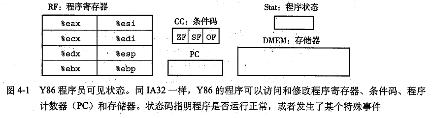
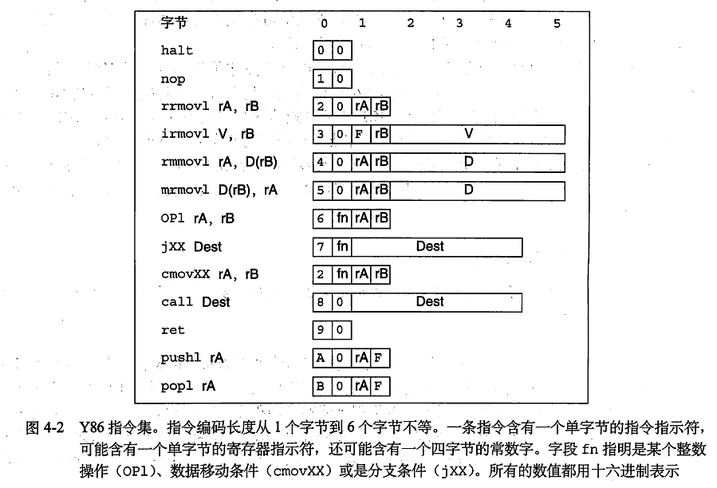

# 处理器体系结构
一个处理器支持的指令和指令的字节级编码称为它的**指令集体系结构(Instruction-Set Architecture, ISA)**。 ISA在编译器和处理器之间提供一个概念抽象层。

## Y86指令集体系结构
Y86有8个程序寄存器：%eax、%ecx、%edx、%ebx、%esi、%edi、%esp、%ebp。有3个一位的条件码：ZF、SF和OF，它们保存最近的算术或逻辑指令造成的影响的有关信息。程序计数器（PC）存放当前正在执行指令的地址。  

Y86使用虚拟地址引用存储器位置。

### Y86指令
Y86只包含四字节整数操作。Y86汇编格式类似IA32的ATT格式    
      

- irmovl、rrmovl、mrmovl和rmmovl分别显示指明源和目的格式，源可以是立即数（i）、寄存器（r）或存储器（m）。指令第一个字母表明源的类型，第二个字母指明