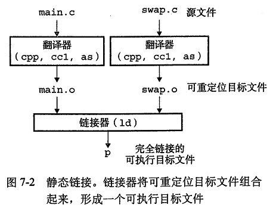

# 链接  
**链接**是将各种代码和数据部分收集起来并组合成为一个单一文件的过程，这个文件可被加载到存储器并执行。  
链接可以执行于编译时；也可以执行于加载时，也就是程序被**加载器(loader)**加载到存储器并执行时；甚至执行于运行时，由应用程序来执行。  
链接由**链接器(linker)**自动执行。

## 编译器驱动程序
两个源文件:
```C
/* main.c */
void swap();

int buf[2] = {1, 2};

int main()
{
    swap();
    return 0;
}

``` 

```C
/* swap.c */
extern int buf[];

int *bufp0 = &buf[0];
int *bufp1;

void swap()
{
    int temp;

    bufp1 = &buf[1];
    temp = *bufp0;
    *bufp0 = *bufp1;
    *bufp1 = temp;
}
```  
调用gcc驱动程序:
```
gcc -O2 -g -o p main.c swap.c
``` 
驱动程序首先运行C与处理器(cpp),翻译C源程序成一个.i的中间文件：
```
cpp [other arguments] main.c -o main.i
```
接下来驱动程序运行C编译器(ccl),将.i文件翻译成.s汇编语言文件：
```
ccl main.c -O2 [other arguments] -o main.s
```
然后驱动程序运行汇编器(as)，将.s文件翻译成一个.o的可重定向目标文件(relocatable object file)：
as [other arguments] -o main.o main.s
最后驱动程序执行链接器程序ld，将.o文件与一些必要的目标文件组合起来，创建一个可执行目标文件(executable object file)：
```
ld -o p [system object files and args] main.o swap.o
```


最后运行可执行文件p时，操作系统调用加载器函数，拷贝p中的代码和数据到存储器，然后将控制转移到这个程序的开头。

## 静态链接
ld这样的静态链接器(static linker)以一组可重定向目标文件和命令行参数作为输入，生成一个完全链接的可以加载和运行的可执行目标文件作为输出。  
链接器必须完成两个主要任务：
- 符号解析(symbol resolution)。目标文件定义和引用符号。符号解析的目的
- 重定位(relocation)。