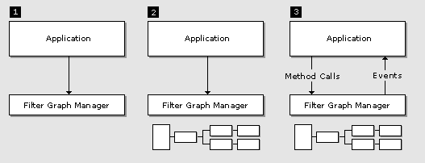

# DirectShow
DirectShow API是Windows下的媒体-流架构。DirectShow的头文件、库、SDK工具和示例可在[Windows SDK](https://developer.microsoft.com/en-us/windows/downloads)中找到。

> Note:早期版本的DirectShow SDK包含在DirectX SDK中，最后的一个包含DirectShow的DirectX是DirectX9.0 SDK Update-(February 2005)Extras。  
> 这之后的版本的DirectShow被移到Windows SDK中。

## 简介
Microsoft® DirectShow® 是一个Windows平台的流媒体架构，提供高质量的多媒体流的捕获和播放。支持多种格式，包括ASF(Advanced System Format), MPEG(Motion Picture Experts Group), AVI(Audio-Video interleaved), MP3(MPEG Audio Layer-3)和WAV音频文件。支持Windows上的基于WDM(Windows Driver Model)和视频的数字和模拟设备捕获。它会自动检测并使用视音频的加速硬件，也支持不带加速硬件的系统。   

DirectShow是基于COM(Component Object Model)的。DirectShow是为C++而设计的，暂时不支持托管(managed)的API。

DirectShow简化了媒体播放，格式转换和捕捉工作，同时提供对底层流的控制访问，也可以创建自己的DirectShow组件以支持新格式或自定义的效果。  

### What's New in DirectShow
#### Windows 7 中新增内容
新的接口:
- [IAMAsyncReaderTimestampScaling](https://docs.microsoft.com/en-us/windows/desktop/api/Strmif/nn-strmif-iamasyncreadertimestampscaling)
- [IAMPluginControl](https://docs.microsoft.com/en-us/windows/desktop/api/Strmif/nn-strmif-iamplugincontrol)

新增或更新的过滤器(filters)：
- [Microsoft MPEG-1/DD/AAC Audio Decoder](https://docs.microsoft.com/zh-cn/windows/desktop/DirectShow/microsoft-mpeg-1-dd-audio-decoder)
- [Microsoft MPEG-2 Video Decoder](https://docs.microsoft.com/zh-cn/windows/desktop/DirectShow/microsoft-mpeg-2-video-decoder)

"智能连接(intelligent connect)"算法已修改为支持preferred和blocked过滤器，详见[ Intelligent Connect](https://docs.microsoft.com/zh-cn/windows/desktop/DirectShow/intelligent-connect)。   

DVD playback：方法[ IDvdControl2::SetOption](https://docs.microsoft.com/en-us/windows/desktop/api/Strmif/nf-strmif-idvdcontrol2-setoption)新增的选项。

#### Windows Vista 中新增内容

......

## DirectShow支持的格式
DirectShow是一个开发架构，也就意味着它支持任何有过滤器(filters)解析和解码的格式。微软提供的过滤器支持下面的文件和压缩格式。

文件类型:  
|文件类型|更多信息|
|-------|--------|
|ASF(Advanced Systems Format),包括WMA(Windows Media Audio),WMV(Windows Media Video)|[WM ASF Reader Filter](https://docs.microsoft.com/zh-cn/windows/desktop/DirectShow/about-the-wm-asf-reader-filter), [WM ASF Writer Filter](https://docs.microsoft.com/zh-cn/windows/desktop/DirectShow/wm-asf-writer-filter)|
|AIFF|[WAVE Parser Filter](https://docs.microsoft.com/zh-cn/windows/desktop/DirectShow/wave-parser-filter)|
|AU|[WAVE Parser Filter](https://docs.microsoft.com/zh-cn/windows/desktop/DirectShow/wave-parser-filter)|
|AVI(Audio-Video Interleaved)|[AVI Mux Filter](https://docs.microsoft.com/zh-cn/windows/desktop/DirectShow/avi-mux-filter),[AVI Splitter Filter](https://docs.microsoft.com/zh-cn/windows/desktop/DirectShow/avi-splitter-filter)|
|MIDI|[MIDI Parser Filter](https://docs.microsoft.com/zh-cn/windows/desktop/DirectShow/midi-parser-filter),[MIDI Renderer Filter](https://docs.microsoft.com/zh-cn/windows/desktop/DirectShow/midi-renderer-filter)|
|SND| |
|WAV|[WAVE Parser Filter](https://docs.microsoft.com/zh-cn/windows/desktop/DirectShow/wave-parser-filter)|

压缩格式:  
|格式|更多信息|
|-----|------|
|AAC|[Microsoft MPEG-1/DD/AAC Audio Decoder](https://docs.microsoft.com/zh-cn/windows/desktop/DirectShow/microsoft-mpeg-1-dd-audio-decoder)|
|Cinepak||
|DV(Digital Video)|[DV Video Decoder Filter](https://docs.microsoft.com/zh-cn/windows/desktop/DirectShow/dv-video-decoder-filter),[DV Video Encoder Filter](https://docs.microsoft.com/zh-cn/windows/desktop/DirectShow/dv-video-encoder-filter)|
|H.264|[Microsoft MPEG-2 Video Decoder](https://docs.microsoft.com/zh-cn/windows/desktop/DirectShow/microsoft-mpeg-2-video-decoder)|
|ISO MPEG-4 video version 1.0||
|Microsoft MPEG-4 version 3||
|MJPEG|[MJPEG Compressor Filter](https://docs.microsoft.com/zh-cn/windows/desktop/DirectShow/mjpeg-compressor-filter), [MJPEG Decompressor Filter](https://docs.microsoft.com/zh-cn/windows/desktop/DirectShow/mjpeg-decompressor-filter)|
|MPEG Audio Layer-3 (MP3) (decompression only)||
|MPEG-1 layer I and layer II audio|[Microsoft MPEG-1/DD/AAC Audio Decoder](https://docs.microsoft.com/zh-cn/windows/desktop/DirectShow/microsoft-mpeg-1-dd-audio-decoder), [MPEG-1 Audio Decoder Filter](https://docs.microsoft.com/zh-cn/windows/desktop/DirectShow/mpeg-1-audio-decoder-filter)|
|MPEG-1 video|[MPEG-1 Video Decoder Filter](https://docs.microsoft.com/zh-cn/windows/desktop/DirectShow/mpeg-1-video-decoder-filter), [Microsoft MPEG-2 Video Decoder](https://docs.microsoft.com/zh-cn/windows/desktop/DirectShow/microsoft-mpeg-2-video-decoder)|
|MPEG-2 audio|[Microsoft MPEG-2 Audio Encoder](https://docs.microsoft.com/zh-cn/windows/desktop/DirectShow/microsoft-mpeg-2-audio-encoder), [Microsoft MPEG-2 Encoder](https://docs.microsoft.com/zh-cn/windows/desktop/DirectShow/microsoft-mpeg-2-encoder)|
|MPEG-2 video|[Microsoft MPEG-2 Encoder](https://docs.microsoft.com/zh-cn/windows/desktop/DirectShow/microsoft-mpeg-2-encoder),[Microsoft MPEG-2 Video Decoder](https://docs.microsoft.com/zh-cn/windows/desktop/DirectShow/microsoft-mpeg-2-video-decoder),[Microsoft MPEG-2 Video Encoder](https://docs.microsoft.com/zh-cn/windows/desktop/DirectShow/microsoft-mpeg-2-video-encoder)|

## 构建DirectShow应用程序
**头文件**  
所有的DirectShow应用程序使用下面的头文件
|头文件|使用|
|------|--|
|Dshow.h|所有的DirectShow应用程序|

一些DirectShow接口需要额外的头文件，这些都列在对应的接口参考中。

**库文件**  
DirectShow使用下表列出的静态库文件
|库文件|描述|
|------|----|
|Strmiids.lib|导出类标识符(CLSID)和接口标识符(IID)|
|Quartz.lib|导出[AMGetErrorText](https://docs.microsoft.com/en-us/windows/desktop/api/errors/nf-errors-amgeterrortexta)函数，如果不需要使用这函数，那这个库可以不用|

使用这些库构建debug和release版本。

## DrectShow应用程序编程简介

### 过滤器(Filters)和过滤器图(Filter Graphs)  
DirectShow的基本要素是一个叫过滤器(filter)的软件组件。过滤器是对多媒体流执行一些操作的软件组件，比如，DirectShow过滤器可以
- 读取文件
- 从视频捕捉设备获取视频
- 解各种流格式，比如MPEG-1
- 将数据传给显卡或声卡

过滤器接收输入产生输出。比如一个过滤器解码MPEG-1视频，输入就是MPEG编码的流，输出是一系列解压缩了的视频帧。

DirectShow中，应用程序处理任何任务(task)都是通过将过滤器练成链来处理的，这样一个过滤器的输出会是另一个过滤器的输入。一列连接的过滤器链叫做过滤器图(filter graph)。比如,下面的图显示了播放AVI文件的过滤器图。   
   
File Source过滤器从硬盘读取AVI文件，AVI Splitter过滤器将文件解析成一路压缩的视频流和一路音频流， AVI Decompressor过滤器解码视频帧，Video Render过滤器使用DirectDraw或GDI显示视频帧,Default DirectSound Device过滤器使用DirectSound播放音频流。

应用程序不需要管理整个数据的处理流程，这些过滤器通过一个Filter Graph Manager来控制，应用程序只需要调用更高层的API，比如“Run”或“Stop”等，如果需要更精细的控制流，可以直接通过COM接口访问。Filter Graph Manager同时将事件通知给应用程序。

Filter Graph Manager的另一个目的是提供应用程序方法去构建过滤器图。

### 编写DirectShow应用程序
大体而言，任何DirectShow应用程序都有3个步骤必须执行，如下图所示：   
   
1. 应用程序创建Filter Graph Manager的一个实例
2. 应用程序使用Filter Graph Manager构建一个过滤器图
3. 应用程序使用Filter Graph Manager控制过滤器图，通过过滤器控制流数据，在这个过程中，应用程序将响应来自Filter Graph Manager的事件

当处理完毕，应用程序释放Filter Graph Manager和所有的过滤器。
DirectShow基于COM, Filter Graph Manager和过滤器都是COM对象。

## 怎样播放一个文件
如上面所说，一个DirectShow应用程序需要执行一些基础步骤：
1. 创建Filter Graph Manager实例
2. 使用Filter Graph Manager构建过滤器图
3. 运行graph, 捕获数据在过滤器间移动

为了创建一个播放文件的DirectShow应用程序，首先得包含Dshow.h头文件和静态库strmiids.lib。  
开始时，调用CoInitalize或CoInitializeEx初始化COM库：
``` C++
HRESULT hr = CoInitialize(NULL);
if (FAILED(hr))
{
    // Add error-handling code here. (Omitted for clarity.)
}
```
下一步，调用CoCreateInstance创建Filter Graph Manager:
``` C++
IGraphBuilder *pGraph;
HRESULT hr = CoCreateInstance(CLSID_FilterGraph, NULL, 
    CLSCTX_INPROC_SERVER, IID_IGraphBuilder, (void **)&pGraph);
```
如代码所示，类标识符是CLSID_FilterGraph. Filter Graph Manager是